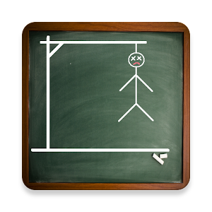
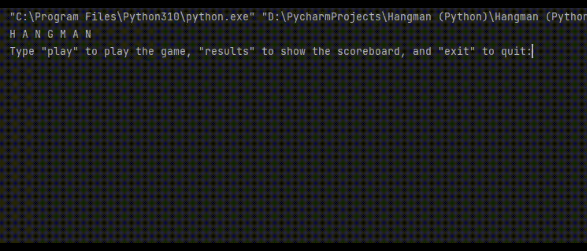

<h1 align="center"><strong><em>Hangman</strong></em></h1>

# About the project

The fifth project that I made in Python.

I made this project by following the <a href=https://hyperskill.org/tracks>JetBrains Academy</a> course.
 
 
# How to start the programm?
* To start the programm you need to have installed Python. [**Download**](https://www.python.org/downloads/)

<h1 align="center"><strong>Demonstration</strong></h1>

